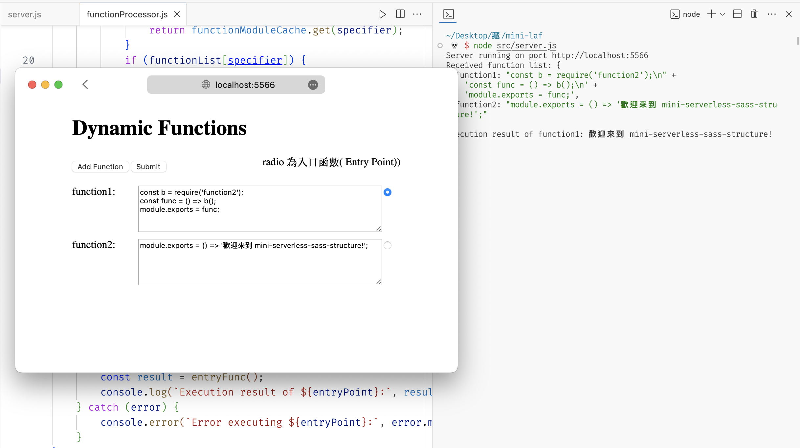

# mini-severless-sass-structure

這個項目的Serverless特點主要體現在後端的處理上。儘管實際運行在一個Node.js服務器上，但它模擬了Serverless架構中的“函數即服務”（Function as a Service, FaaS）模式。
後端不是一個持續運行的應用，而是對於前端發來的特定請求（即JavaScript函數代碼），動態載入並以隔離且安全的環境中執行。
這種方式減少了服務器的持續資源消耗，並且使得後端可以專注於按需處理函數的執行。


## 主要特點：

模擬Serverless架構：後端服務器接收前端發送的函數代碼，並按需執行這些代碼，模擬了Serverless架構中的“函數即服務”模式。
前端交互：用戶可以通過簡潔的前端界面動態地添加和提交JavaScript函數代碼。
後端執行和安全性：後端Node.js服務器在隔離的環境中執行用戶代碼，確保了代碼的安全執行。
實驗和學習平台：為初學者提供了一個理想的環境來實驗並理解Web開發、Node.js和Serverless架構的基本原理。

## 運行方式：

1. 克隆或下載倉庫到本地。
運行 `node src/server.js` 啟動服務器。
2. 在瀏覽器中訪問 `http://localhost:5566`
並使用提供的界面進行函數代碼的輸入和提交。
3. 後端 Node.js 服務器將執行這些函數代碼，並將結果以日誌形式輸出在終端中。

前端示例函數：

- 函數1 (function1)：返回一個簡單的歡迎消息。(勾選radio為Entry Point)
```js
const b = require('function2');
const func = () => b();
module.exports = func;
```

- 函數2 (function2)：執行基本的數學運算。
```js
module.exports = () => '歡迎來到 mini-serverless-sass-structure!';
```

送出後可以看到日誌輸出
```shell
Received function list: {
  function1: "const b = require('function2');\n" +
    'const func = () => b();\n' +
    'module.exports = func;',
  function2: "module.exports = () => '歡迎來到 mini-serverless-sass-structure!';"
}
Execution result of function1: 歡迎來到 mini-serverless-sass-structure!
```
